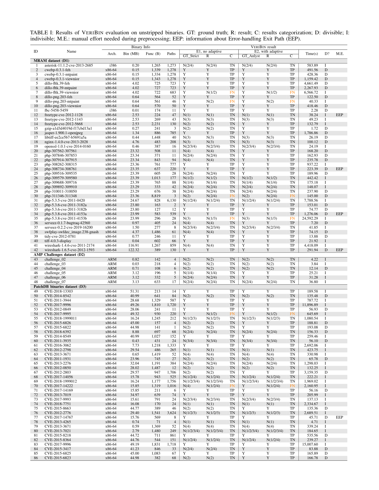

### Table I: Detailed Veribin Results for Unstripped Dataset
- **Description:** This table provides a comprehensive evaluation of VeriBin on unstripped binaries across 86 patches.

### Table II: Ablation Study Results of VeriBin
- **Description:** This table presents the ablation study results of VeriBin on unstripped binaries across 86 patches.

For further analysis, you can download the detailed tables in Excel format: [VeriBin_Experiment_Results.xlsx](VeriBin_Experiment_Results.xlsx).